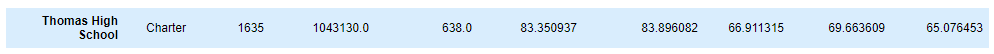
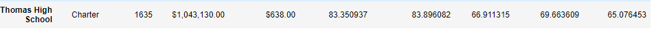

# School District Analysis
## Overview
The purpose of this analysis was to replace all of the 9th grade test scores at Thomas High School with Na’s because f academic dishonesty. Then I ran a new analysis on the whole school district to get a more honest analysis.
## Results
Effects on district summary

Old

New

* Average Math Score: decreased by 0.1
* Average Reading Score: stayed the same
* % Passing Math: decreased by 0.2
*  % Passing Reading: decreased by 0.1
* % Overall Passing: decreased by 0.3

The change only affected Thomas High School.

Old

New

Effects
*  Average Math Score: stayed the same
* Average Reading Score: increased by 0.1
* % Passing Math: decreased by 0.1
* % Passing Reading: decreased by 0.3
* % Overall Passing: decreased by 0.3
Thomas High school did not change in its overall position among other schools. It remained at number 2.

How does replacing the ninth-grade scores affect the following:
* Scores by school spending:
  * There was no change

Old

New

* Scores by school size:
  * There was no change

Old

New

* Scores by school type:
  * There was no change

Old

New

## Summary
The first thing that changed was the average slightly decreased in the district summary. Another change was that the percent passing math in the district slightly decreased.  The overall passing percentage in the district decreased by 0.3. Also the overall passing percent for Thomas High School decreased by 0.3. 
